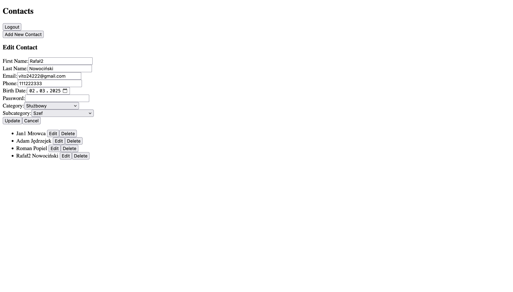
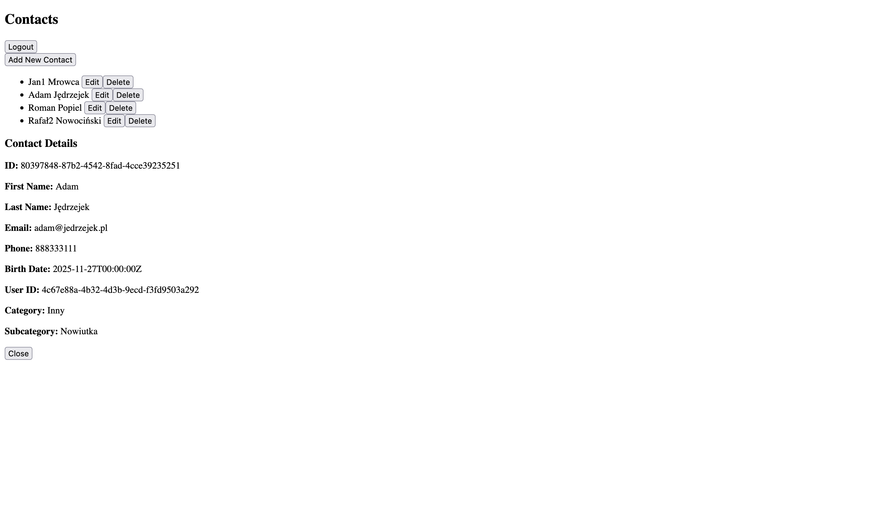

# Ogólny opis

Prosta aplikacji w technologiach Angular, .NET oraz PostgreSQL reprezentująca książkę adresową z listą kontaktów.

## Struktura plików
Struktura plików projektu:
- **backend-zadanie-1** - część backendowa w .NET
  - **API** - podprojekt zawierający kontrolery REST API
  - **Infrastructure** - podprojekt zawierający implementacje repozytoriów, serwisów oraz konfigurację bazy danych
  - **Core** - posiada definicje encji oraz interfejsów do operownia na nich
- **frontend-zadanie-1** - część frontendowa w Angular'ze. Zawartość katalogu src/app:
  - **contacts** - zawiera logikę jedynego z dwóch komponentów aplikacji ContactsComponent
  - **interceptors** - zawiera logikę przechwytywania i modyfikowania żądań HTTP wychodzących z aplikacji
  - **login** - komponent strony logowania
  - **services** - posiada serwisy do autoryzacji oraz pobierania kontaktów z ich kategoriami i subkategoriami

## wykorzystane biblioteki
- backend: Entity Framework Core, Npgsql, JWT Bearer, BCrypt, OpenAPI
- frontend: domyślne biblioteki Angular

## Instalacja

### Wymagania
- **Node.js** (wersja 18 lub nowsza)
- **Angular CLI** 20.3.8
- **.NET SDK** 9.0
- **PostgreSQL** (wersja 14 lub nowsza)

### Konfiguracja bazy danych

1. Zainstaluj PostgreSQL i utwórz bazę danych:
```sql
CREATE DATABASE ContactsDB;
CREATE USER ContactUser WITH PASSWORD 'jk822kljqw';
GRANT ALL PRIVILEGES ON DATABASE ContactsDB TO ContactUser;
```

2. Baza danych zostanie automatycznie zainicjalizowana przy pierwszym uruchomieniu backendu (seeding danych).

### Backend (.NET)

1. Przejdź do katalogu backendu:
```bash
cd backend-zadanie-1/API
```

2. Przywróć zależności:
```bash
dotnet restore
```

3. Uruchom migracje bazy danych (jeśli są dostępne):
```bash
dotnet ef database update
```

4. Uruchom aplikację:
```bash
dotnet run
```

Backend będzie dostępny pod adresem: `http://localhost:5088`

### Frontend (Angular)

1. Przejdź do katalogu frontendu:
```bash
cd frontend-zadanie-1
```

2. Zainstaluj zależności:
```bash
npm install
```

3. Uruchom aplikację:
```bash
npm start
```

Frontend będzie dostępny pod adresem: `http://localhost:4200`

## Domyślne dane logowania

Po pierwszym uruchomieniu aplikacji zostanie utworzone konto administratora:
- **Email:** admin@netpc.pl
- **Hasło:** **\*\*TSCBf2hS\*\***

## Funkcjonalności

- **Autoryzacja JWT** z automatycznym odświeżaniem tokenów
- **CRUD kontaktów** z kategoriami i subkategoriami
- **Dynamiczne tworzenie subkategorii** dla kategorii "Inny"
- **Filtrowanie subkategorii** według wybranej kategorii
- **Wylogowanie** z czyszczeniem sesji

## Zrzuty ekranu

### Strona logowania


### Lista kontaktów z formularzem edycji


### Szczegóły kontaktu
